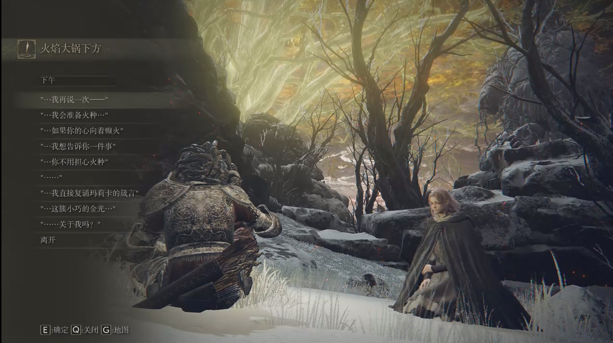

# EldenRingMod-chat-with-Melina

让玩家能够在赐福与梅琳娜聊天的mod

[NEXUS MOD](https://www.nexusmods.com/eldenring/mods/1587)

[Video preview(Youtube)](https://youtu.be/PjGv6Fyrx1Y)

[Video preview(Bilibili)](https://www.bilibili.com/video/BV1vB4y1s7AY)



## 警告

跟梅琳娜聊天的时候**不要突然关闭游戏**，因为在聊天时mod通过修改(进入对话后能够确定值的)某些事件标志位来达成分辨选项的目的，如果在对话未结束，未复原标志位，理论上会导致游戏存档进度不正确。(在未来摸清更多even flag 比如未使用的后会改进)

## 安装

推荐使用 [modEngine2](https://github.com/soulsmods/ModEngine2) 安装

## 能够聊天的进度

与梅琳娜达成约定后 ~ 王城分离前
击败噩兆后重新会合 ~ 被发现接受癫火/烧树

## 聊天条目

条目(例如箴言)需要被 "与梅琳娜交谈" 触发过才能在聊天界面选择,目前一共有17句对话(实际在游戏中最多能看到16句)。

## 修改的对话脚本

```xml
script\talk\m00_00_00_00-talkesdbnd-dcx\GR\data\INTERROOT_win64\script\talk\m00_00_00_00

t000001000.py
t000003000.py
```

## 新增的文本ID (EventTextForTalk)

除了中文简体、中文繁体，其他语言版本的聊天选项都设置为英文翻译。如果你想新增翻译,请看```intl``` 文件夹, 只需要翻译70000000 到 70000000 70000002 即可，剩余文本来自游戏对话。

```xml
msg\zhocn\menu-msgbnd-dcx\GR\data\INTERROOT_win64\msg\zhoCN\EventTextForTalk.fmg.xml
```

``` xml
<text id="70000000">召唤梅琳娜</text>
<text id="70000001">遣返梅琳娜</text>
<text id="70000002">和梅琳娜聊天</text>

<text id="70000101">"……关于我吗？</text>
<text id="70000102">"……这簇小巧的金光，是黄金树的赐福。</text>
<text id="70000103">"“噢，拉达冈啊，黄金律法的忠犬啊。”</text>
<text id="70000104">"“我在此宣告，去探索黄金律法──”</text>
<text id="70000105">"“王的众战士啊，吾王葛孚雷啊。”</text>
<text id="70000106">"“吾王啊，王的众战士啊，我将夺去你们的赐福。”</text>
<text id="70000107">"“在你们面临死亡之后，那被夺去的会再归还──”</text>
<text id="70000108">"“黄金树是掌管一切的存在。做出抉择吧──”</text>
<text id="70000109">"……你的身体里，还住着另外一个人吗？</text> (约定)
<text id="70000110">"……你的身体里，还住着另外一个人吗？</text> (旅行)
<text id="70000111">"……你不用担心火种。</text>
<text id="70000112">"“半神啊，我可爱的孩子啊。”</text> 
<text id="70000113">"……我想告诉你一件事。</text>
<text id="70000114">"……如果你的心向着癫火，</text>
<text id="70000115">"……我会准备火种。</text>
<text id="70000116">"请让你的心，远离癫火吧。</text>
<text id="70000117">"拜托你了，能不能悬崖勒马？</text>
```

## TODO

- 只检查是否通过梅琳娜烧树，即使癫火仍然允许聊天？

- 增加 ```<text id="100130000">The Erdtree...is close.</text>``` 、```<text id="100170000">We're almost there.</text>```，游戏如何检查玩家在黄金树/大锅附近？

## mod 实现

为什么不能突然关闭游戏?
TBC

## 聊天选项与具体文本的对应关系

``` xml
event Text for talk id |  talk msg id
70000100 | 保留为空
70000101 | <text id="100031000">……关于我吗？</text>
70000102 | <text id="100030000">……这簇小巧的金光，是黄金树的赐福。</text>
70000103 | <text id="100102010">“噢，拉达冈啊，黄金律法的忠犬啊。”</text>
70000104 | <text id="100103010">“我在此宣告，去探索黄金律法──”</text>
70000105 | <text id="100104010">“王的众战士啊，吾王葛孚雷啊。”</text>
70000106 | <text id="100041010">“吾王啊，王的众战士啊，我将夺去你们的赐福。”</text>
70000107 | <text id="100044010">“在你们面临死亡之后，那被夺去的会再归还──”</text>
70000108 | <text id="100045010">“黄金树是掌管一切的存在。做出抉择吧──”</text>
70000109 | <text id="100120010">……你的身体里，还住着另外一个人吗？</text> (约定)
70000110 | <text id="100121010">……你的身体里，还住着另外一个人吗？</text> (旅行)
70000111 | <text id="100150000">……你不用担心火种。</text>
70000112 | <text id="100101010">“半神啊，我可爱的孩子啊。”</text> 
70000113 | <text id="100160000">……我想告诉你一件事。</text>
70000114 | <text id="100180000">……如果你的心向着癫火，</text>
70000115 | <text id="100181000">……我会准备火种。</text>
70000116 | <text id="100185010">请让你的心，远离癫火吧。</text>
70000117 | <text id="100186000">拜托你了，能不能悬崖勒马？</text>
```

## 其他(与mod无关)

### 被跳过的文本

在击败王城噩兆后与梅琳娜的对话中，下面的文本 ```<text id="100140010">```的文本是被跳过的(也没有对应语音)。

```xml
<text id="100140000">……好久不见了。</text>
...
<text id="100140010">你还记得我吗？我是梅琳娜。</text>
...
<text id="100140020">我想和你聊一聊。</text>
```

### 不同称呼

根据是否持有洛德符节，梅琳娜会将与玩家一同前进区分称呼为"约定(前往黄金树根脚)"或者"旅行(前往火焰大锅)"，仿身泪滴废案也如此，这也是为什么最多只能看到16句对话。

## 鸣谢

- FromSoftware
- the [?ServerName? discord](https://discord.gg/97qU4236)
- [JKAnderson's UXM](https://github.com/JKAnderson/UXM) and [Nordgaren's selective UXM](https://github.com/Nordgaren/UXM-Selective-Unpack) and elden ring's version form ?ServerName? discord
- [Yabber](https://github.com/JKAnderson/Yabber)
- [souls Mod engine2](https://github.com/soulsmods/ModEngine2)
- [edstools](https://github.com/thefifthmatt/ESDLang)
