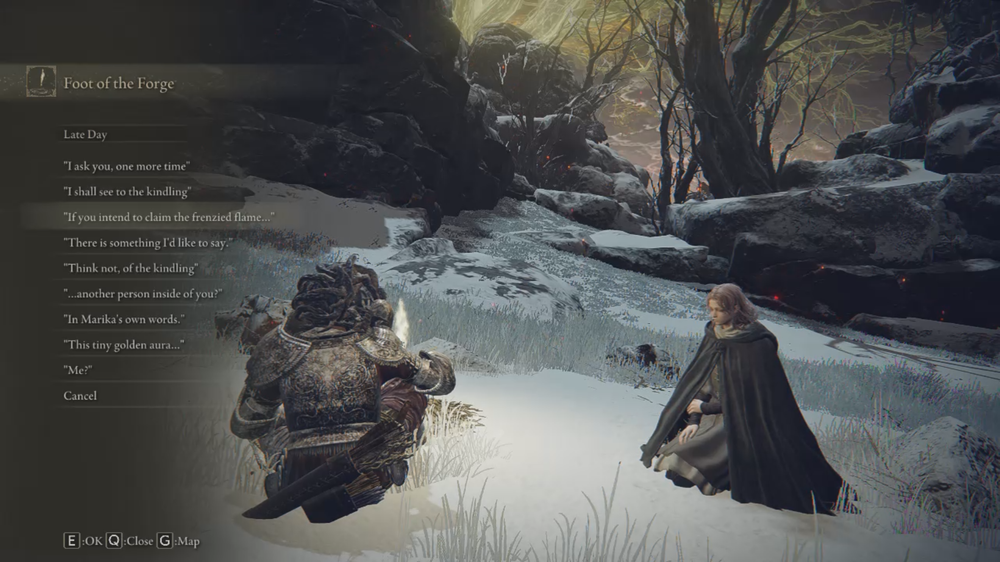

# EldenRingMod-chat-with-Melina

English | [中文](README-zhcn.md)

an elden ring mod allow player summon and chat with melina at site of grace

[NEXUS MOD](https://www.nexusmods.com/eldenring/mods/1587)

[Video preview(Youtube)](https://youtu.be/PjGv6Fyrx1Y)

[Video preview(Bilibili)](https://www.bilibili.com/video/BV1vB4y1s7AY)



## Alert

**DO NOT close game suddenly** when chatting with melina, because the mod "pass" the chatting option player chosen through setting 5 even flags, whos values are certained when chatting. Their values will be set back to centain value after the "chat" end.If you turn off game while chatting with melina, these event flag may not be set back and your game save's progress may be weird. ((It may improve after figuring out more even flags' meaning or unused ones in the future))

## Installation

Recommending [modEngine2]("https://github.com/soulsmods/ModEngine2")

## When can player chat with melina?

accept melina's accord ~ separating after arrive Leyndell, Royal Capital(grace:East Capital Rampart) for the first time

"reunite after beat "Morgott, The Omen King" ~ burn the erdtree / accept frame of frenzy

## Chatting enties

chatting enties will be add into chatting menu after told by melina, so try to exhaust her talk.There are 17 dialogues in file and you can actually see up to 16 sentences in the game.

## Modified talk script

```xml
script\talk\m00_00_00_00-talkesdbnd-dcx\GR\data\INTERROOT_win64\script\talk\m00_00_00_00

t000001000.py
t000003000.py
```

## New added text id (EventTextForTalk)

Except for Simplified Chinese and Traditional Chinese, the chat options of other language versions are set to English translation. If you want to add translations, check the ``` intl ``` folder.You can just translate 70000000 to 70000002, the rest of the text is from the game dialogue.

```xml
msg\engus\menu-msgbnd-dcx\GR\data\INTERROOT_win64\msg\engUS\EventTextForTalk.fmg.xml
```

``` xml
<text id="70000000">Summon Melina</text>
<text id="70000001">Let Melina Leave</text>
<text id="70000002">Chat With Melina</text>

<text id="70000100">%null%</text>
<text id="70000101">"Me?"</text>
<text id="70000102">"In Marika's own words."</text>
<text id="70000103">"In Marika's own words."</text>
<text id="70000104">"In Marika's own words."</text>
<text id="70000105">"In Marika's own words."</text>
<text id="70000106">"In Marika's own words."</text>
<text id="70000107">"In Marika's own words."</text>
<text id="70000108">"In Marika's own words."</text>
<text id="70000109">"...another person inside of you?"</text>
<text id="70000110">"...another person inside of you?"</text>
<text id="70000111">"Think not, of the kindling"</text>
<text id="70000112">"This tiny golden aura..."</text>
<text id="70000113">"There is something I'd like to say."</text>
<text id="70000114">"If you intend to claim the frenzied flame..."</text>
<text id="70000115">"I shall see to the kindling"</text>
<text id="70000116">"I ask you, one more time"</text>
<text id="70000117">"Please, put a stop to this madness"</text>
```

## TODO

- Handle specific dialogue options for other languages (provided by talkMsg)
- Only check if the erdtree is burned through Melina, allow chatting even player accept the frenzy frame?
- Because of not knowing how to check the spirit ashes held by the player, the current mimic tear quest Abolition dialog ```<text id="70000109">"…"</text>``` and ```<text id ="70000110">"…"</text>``` is mainly triggered by checking if the finger slayer blade is in possession, however as the process progresses, the player will lose the item.

## Mod implement

to be complete

## Correspondence between chat options and specific texts

to be complete

## Other (not related to mod)

### Skipped text

After beatting "Morgott, The Omen King" and talk with melina，the text below ```<text id="100140010">``` is skipped (and has no corresponding voice).

```xml
<text id="100140000">Hello again, old friend.</text>
...
<text id="100140010">It's me, Melina. Your travelling companion.</text>
...
<text id="100140020">Allow me a moment to converse with you.</text>
```

### Different names

Depending on whether player has Rold Medallion or not, Melina will call it "accord (to the Golden Roots)" or "Travel (to the Fire peak)" of moving together with the player. So as the mimic tear quest, that's why actually see up to 16 sentences in the game

## Credits

- FromSoftware
- the [?ServerName? discord](https://discord.gg/97qU4236)
- [JKAnderson's UXM](https://github.com/JKAnderson/UXM) and [Nordgaren's selective UXM](https://github.com/Nordgaren/UXM-Selective-Unpack) and elden ring's version form ?ServerName? discord
- [Yabber](https://github.com/JKAnderson/Yabber)
- [souls Mod engine2](https://github.com/soulsmods/ModEngine2)
- [edstools](https://github.com/thefifthmatt/ESDLang)
